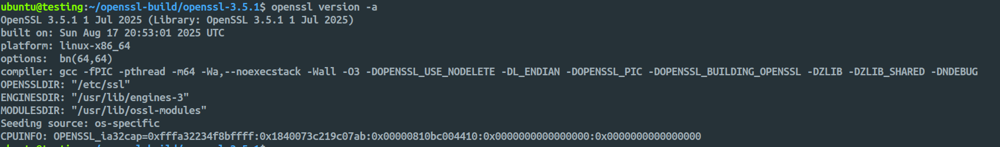

# OpenSSL Installation Guide

## Overview

This guide explains how to build and install the latest stable version of [OpenSSL](https://github.com/openssl/openssl) (3.5.x LTS or higher) in the system’s default locations.  

> [!IMPORTANT]
> Perform this installation in a **virtual machine (VM)** for testing to avoid breaking system dependencies.

## Prerequisites Check
First, check your current OpenSSL version and system details:

```bash
# Check current OpenSSL version
openssl version -a

# Check system architecture
uname -a

# Check if you have the required tools
which gcc || which clang
which make
which perl
```

## Required Dependencies
Install the build dependencies:

For Ubuntu/Debian:

```bash
sudo apt update
sudo apt install -y build-essential checkinstall zlib1g-dev libssl-dev
sudo apt install -y perl-modules-5.* perl-doc
```

## Step 1: Download and Verify OpenSSL 3.5.x

OpenSSL 3.5.x can be downloaded from the official [GitHub releases page](https://github.com/openssl/openssl/releases/)

```bash
# Create working directory
mkdir -p ~/openssl-build && cd ~/openssl-build

# Download OpenSSL 3.5.1 (or latest version)
wget https://github.com/openssl/openssl/releases/download/openssl-3.5.1/openssl-3.5.1.tar.gz
wget https://github.com/openssl/openssl/releases/download/openssl-3.5.1/openssl-3.5.1.tar.gz.sha256

# Verify download integrity
sha256sum -c openssl-3.5.1.tar.gz.sha256

# Extract the archive
tar -xzf openssl-3.5.1.tar.gz
cd openssl-3.5.1
```


## Step 2: Remove Old OpenSSL (Optional but Recommended)

> [!WARNING]  
> This step removes the existing OpenSSL. Only proceed if you have backups and understand the risks.

```bash
# Remove old OpenSSL installations (be very careful)
sudo rm -f /usr/local/bin/openssl
sudo rm -f /usr/local/lib/libssl.*
sudo rm -f /usr/local/lib/libcrypto.*
sudo rm -rf /usr/local/include/openssl
sudo rm -rf /usr/local/lib/engines*
sudo rm -rf /usr/local/share/man/man1/openssl*
sudo rm -rf /usr/local/share/man/man3/SSL*
sudo rm -rf /usr/local/share/man/man3/crypto*

# Update library cache
sudo ldconfig
```

## Step 3: Configure OpenSSL 3.5.x

Configure OpenSSL for system-wide installation in default locations:

```bash
./Configure --prefix=/usr --openssldir=/etc/ssl \
    --libdir=lib \
    shared \
    zlib-dynamic \
    "-Wl,-rpath,\$(LIBRPATH)"
```

Configuration Options Explained:

- `--prefix=/usr`: Install base files in `/usr`
- `--openssldir=/etc/ssl`: Store configuration files in `/etc/ssl`
- `--libdir=lib`: Use `/usr/lib` for libraries (instead of `/usr/lib64`)
- `shared`: Build shared libraries
- `zlib-dynamic`: Enable dynamic zlib compression support
- `"-Wl,-rpath,\$(LIBRPATH)"`: Set runtime library path

## Step 4: Compile OpenSSL

```bash
# Compile OpenSSL (parallel build using all available cores)
make -j$(nproc)

# Run test suite (recommended but optional)
make test
```

## Step 5: Install OpenSSL

```bash
# Install OpenSSL (requires root privileges)
sudo make install

# Update library cache
sudo ldconfig
```

## Step 6: Verify Installation

**Check which OpenSSL is being used by default:**

```bash
which openssl
openssl version -a
```

